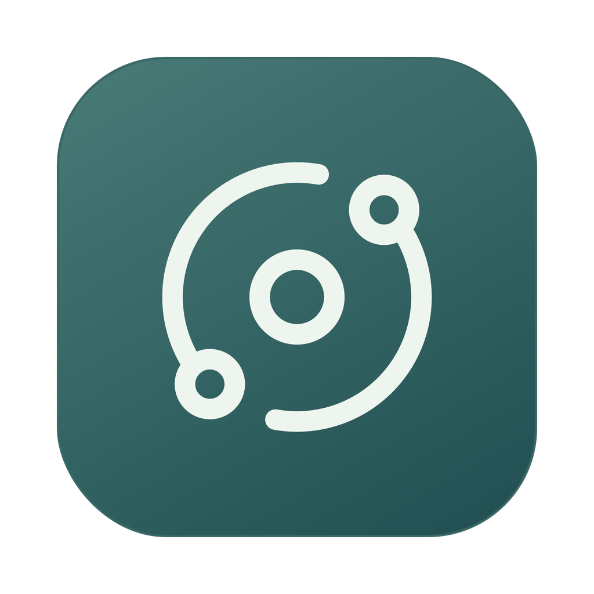
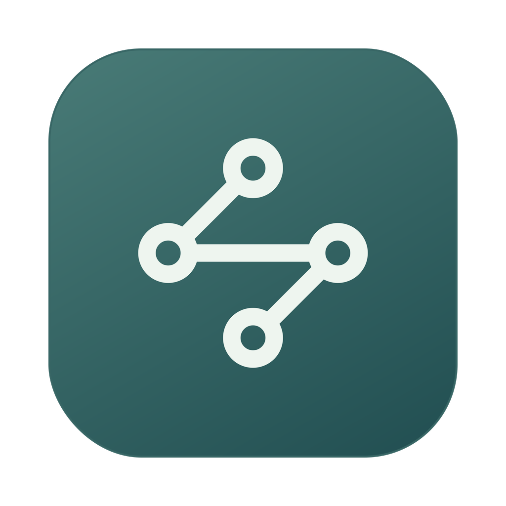

# Relay app icon example

A worked example from the Relay design conversation, with the delivered files
preserved in [assets/examples/relay](../assets/examples/relay/). Use it to understand
the progression from a brief to usable icon packages. The palette, symbols, and
2026-09-23 material baseline belong to this example; refresh Apple's guidance for
a new project.

## Brief

The requests below consolidate the conversation into one example:

> 我做了个 Relay 的 app，在 macOS 最新系统上，帮我找个优雅的 icon。
>
> 这两个图不错，直接给我 PNG 图标，注意适配 macOS 视网膜屏。
>
> 再提供支持 Liquid Glass 的原生 `.icon` 和 SVG 等必要文件的下载包。
> 如果有可用的本地 Mac Computer Use 能力，就生成原生预览；没有就跳过。

## Process and decisions

| Step | Action and result |
| --- | --- |
| Find candidates | Select Lucide [Orbit](https://lucide.dev/icons/orbit) and [Waypoints](https://lucide.dev/icons/waypoints). Orbit suggests movement and exchange; Waypoints suggests connected relay points. Both remain distinct at small sizes. |
| Follow the selection | The user liked both designs, so finish and deliver both. Retain the chosen artwork through later format and material requests. |
| Customize the SVGs | Preserve the recognizable geometry, expand rounded strokes into filled paths, center the symbols, and use a teal gradient from `#497B77` to `#214E51` with warm-white `#EEF5EF` artwork. The normal stroke width is derived from `1.65` units on Lucide's 24-unit canvas. |
| Prepare static macOS files | Use a 1024-unit canvas with transparent outer margins and a rounded static enclosure. Render each Retina representation from vector geometry, with slightly stronger strokes and larger symbols at 16 pt and 32 pt. This enclosure is an approximation, not Apple's native mask. |
| Explain the source | These two symbols come from Lucide. The palette, outlines, spacing, enclosures, and packaging are adaptations. Other libraries remain possible; the work does not imply an exhaustive search or an exclusive original brand mark. |
| Add Liquid Glass documents | Keep the foreground unmasked and free of baked lighting. Create actual `.icon` packages containing `icon.json` and SVG assets, with glass, restrained translucency, highlights, refraction, and appearance variants. Let Icon Composer and macOS render the enclosure and material. |
| Check and deliver | Check image sizes, color profiles, asset manifests, ICNS contents, native asset references, and ZIP integrity. No usable Mac was available, so skip native preview and clearly report that limit. |

The first delivery contained static resources and SVG layers for import into
Icon Composer. A later delivery added the actual native documents. These are
preserved as two archives below. For a new request, the skill normally bundles
the final native and static resources together.

## Results

These are the original **static PNGs**, not Apple-rendered Liquid Glass previews.

| Relay Orbit | Relay Waypoints |
| --- | --- |
|  |  |
| [Original Lucide SVG](../assets/examples/relay/lucide-orbit-original.svg) · [Customized app SVG](../assets/examples/relay/Relay-Orbit.svg) | [Original Lucide SVG](../assets/examples/relay/lucide-waypoints-original.svg) · [Customized app SVG](../assets/examples/relay/Relay-Waypoints.svg) |

- [Static Retina bundle: Relay-macOS-Icons.zip](../assets/examples/relay/Relay-macOS-Icons.zip)
  contains both designs' 1024 px PNGs, `.icns` files, `AppIcon.appiconset`, original
  and edited SVGs, Icon Composer import layers, menu-bar templates, integration
  notes, and license notices.
- [Native bundle: Relay-Liquid-Glass.icon.zip](../assets/examples/relay/Relay-Liquid-Glass.icon.zip)
  contains `Relay-Orbit.icon` and `Relay-Waypoints.icon`, each with `icon.json`
  and its foreground asset, plus integration notes and license notices.
- [Lucide license and inherited notices](../assets/examples/relay/LICENSE-Lucide.txt)
  apply to the copied source and derived artwork. They are also included in both
  archives.

When viewing an archive on GitHub, use **Download raw file** to download it.
The original source SVGs are retained as fetched; their upstream commit was not
recorded, so do not invent a pinned source revision for this historical example.

Each static design has all 10 macOS app-icon slots: 16, 32, 128, 256, and 512 pt
at both 1x and 2x, including the 1024 px Retina representation. Menu-bar templates
are 18 px and 36 px for an 18 pt status item. See
[macos-delivery.md](macos-delivery.md) for the size mapping and current workflow.

## Validation and handoff

The preserved results passed checks for JSON and SVG structure, referenced native
assets, PNG decoding and dimensions, sRGB profiles, Retina slots, ICNS containers,
and archive integrity. Native document opening, material preview, and Xcode
compilation were **not run**. The PNGs above do not validate native glass behavior.

For the static route, import one design's `AppIcon.appiconset` into the app's
asset catalog. For the native route, unzip the native bundle, keep each `.icon`
package intact, open the chosen document in Icon Composer, and add it to the Xcode
target using its name without the `.icon` extension. Choose one design for a
target; both static alternatives intentionally use the asset name `AppIcon`.

For future designs, use `scripts/build_icon.py` with the chosen original SVG and
the current brief. Its defaults and implementation may evolve; it is not a
byte-for-byte reconstruction of these archived results. Preserve honest native
validation notes and follow the skill's optional local Mac preview step.
